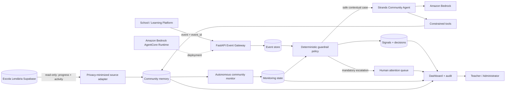

# Architecture

## Data minimization

The Supabase adapter does not fetch the full learner state JSON. It projects only
`state.progress` plus the minimal learner/activity fields needed by the monitor. Contacts,
PINs, chats, notes, drafts, scratch data, payments and support-message bodies are outside the
agent data path.

The adapter is read-only. The hackathon agent writes its own operational records to its own
store rather than modifying the school's learner state.

## Deterministic safety boundary

Consequential actions are evaluated before model reasoning. Payments, enrollment/expulsion,
punishment, account deletion, course-access changes and other high-impact decisions are not
model-executable actions. They are converted into human follow-ups.

## Autonomous monitor

Each monitoring run can optionally synchronize the latest privacy-minimized learner state,
then scan every learner for inactivity, unresolved repeated failures and accumulated support
signals. Active conditions are deduplicated and later cleared when evidence disappears.

A Supabase synchronization failure is reported but does not turn off the deterministic local
monitor.

## Strands / AWS path

For contextual cases, the Strands agent can retrieve learner context and create a support
note through constrained tools. Amazon Bedrock provides model inference. The AgentCore
runtime adapter is included for AWS deployment once the competition environment is active.
