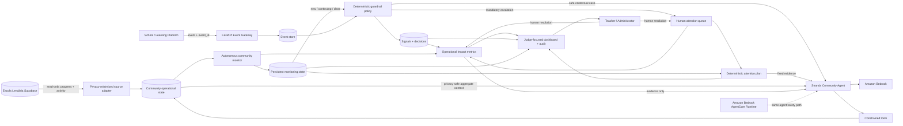

# Architecture



## Architectural principle: model over evidence, not model over authority

The language model does not own the high-impact decisions or the priority formula. Deterministic layers first establish:

- whether a case must go to a human;
- the persistent risk episode;
- the priority score for open human work;
- the operational metrics the product can truthfully claim.

Strands + Amazon Bedrock then reason **over** that evidence: they can explain context, generate a community briefing and create bounded advisory support notes, but they cannot rewrite the fixed safety/priority decisions.

## Data minimization

The Supabase adapter does not fetch the full learner state JSON. It projects only `state.progress` plus minimal learner/activity fields needed by the monitor. Contacts, PINs, chats, private notes, drafts, scratch data, payments and support-message bodies are outside the agent data path.

The source connection is read-only. The hackathon agent writes its operational monitoring/audit records to its own store rather than modifying learner state.

The public live judge endpoint uses temporary aliases and aggregate risk evidence; it does not return names or raw learner IDs.

## Autonomous monitor

Each run can optionally synchronize current privacy-minimized learner state and then scan every learner for:

- inactivity after prior engagement;
- unresolved repeated failures;
- accumulated recent support signals.

A risk episode is persisted across runs. An unchanged episode does not create a new human task. When evidence disappears, the condition is marked clear and its monitor-generated open follow-up is closed.

A source or Bedrock outage does not disable the deterministic local monitor.

## Deterministic human attention plan

`src/community_agent/triage.py` ranks open human follow-ups using:

```text
priority = urgency base + active-risk bonus + waiting-time bonus
```

This ranking addresses the real capacity constraint of a small school. The model can explain the ranked plan but cannot change the underlying scores or resolve a case.

## Operational evidence

`src/community_agent/impact.py` derives metrics from the operational store, including scans, new alerts, continuing conditions without duplicate alerts, clearing and human resolutions.

These metrics are explicitly labeled as **observed agent behavior**, not causal evidence of better grades, retention or completion. Longitudinal evaluation is described in `docs/IMPACT_MEASUREMENT.md`.

## Deterministic safety boundary

Consequential actions are evaluated before model reasoning. Payments, enrollment/expulsion, punishment, account deletion, course-access changes, medical/legal actions and safeguarding decisions are not model-executable tools. They become human follow-ups.

Model-authored advisory notes also pass an independent deterministic validator before persistence.

## Strands / Amazon Bedrock path

The model-facing tools are limited to:

- privacy-safe aggregate community overview;
- deterministic attention plan;
- operational impact metrics;
- factual learner context;
- open follow-up visibility;
- bounded advisory support-note creation.

Amazon Bedrock provides model inference. `src/community_agent/agentcore_runtime.py` exposes the same agent/safety path for AgentCore runtime actions including event handling and community briefing. See `docs/AGENTCORE.md`.

## Security and verification

Every push/PR runs:

1. high-confidence secret-pattern scan;
2. Python compile check;
3. Ruff lint;
4. pytest.

See `SECURITY.md` and `.github/workflows/ci.yml`.
